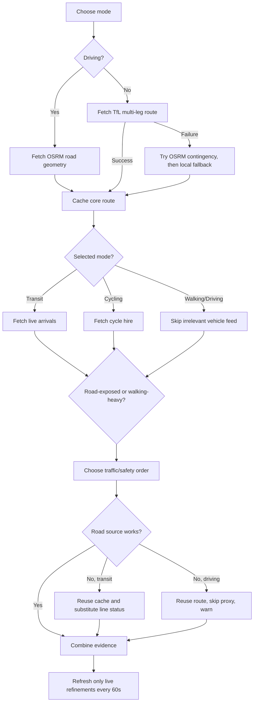

# Wayfinder London — resilient route agent

Wayfinder is a working London journey planner that keeps a usable route when a live data source fails. It plans with TfL transport data or an OSRM driving route, adds live arrivals or cycle-hire information, filters current TfL road disruptions against the learned route, and records every decision, failure and recovery action in the interface.

The UI has two clear screens: choose the journey and preferred transport first, then view route legs, live context, recovery evidence and the agent decision log.

## Assessment requirements

| Requirement | Implementation |
| --- | --- |
| Multi-leg London journey | TfL Journey Planner returns coherent walking and transport legs; Driving uses an OSRM road route. |
| At least three sequential, learned decisions | Route/mode selection, mode-specific enrichment, walking-exposure ordering, failure policy and final combination are explicit decisions. |
| Not a fixed pipeline | Walking time determines whether safety or traffic is queried first; selected mode determines whether arrivals, cycle hire or no vehicle feed is useful. |
| Mid-execution failure recovery | Demo mode injects a TfL Road HTTP 503 after earlier work has completed. |
| Reuse partial results | A run-scoped cache retains the route, live-mode context and safety result. |
| Retry, substitute or skip | Deterministic 503s are not retried; line status substitutes for transit delay context; Driving skips a misleading rail substitute and shows an explicit warning. |
| No restart | `completedStepsReplayed` stays `0` and mocked tests assert that completed providers are called once. |
| Usable final output | Route legs remain visible with confidence and caveats attached only to unavailable data. |

## Core features and why they exist

- **16 London locations** — broad enough to demonstrate central, east, west and outer-London journeys without introducing a geocoder as another failure point.
- **Six transport preferences** — Recommended, Rail & Tube, Bus, Driving, Walking and Cycling. TfL handles transit/walking/cycling modes; OSRM supplies an actual road geometry for Driving.
- **Mode-aware live data** — transit routes query TfL Live Arrivals using the learned first stop ID; cycling routes query TfL Cycle Hire; Driving and Walking deliberately skip irrelevant arrival calls.
- **Route-local traffic warnings** — TfL road disruptions are projected onto the learned geometry. Bus and Driving show a prominent warning with nearby alert details and distance from route.
- **Automatic live refresh** — route-local disruptions plus applicable arrivals/cycle availability refresh every 60 seconds. If a refresh fails, the UI retains the last successful values; it never reruns the core route or published safety query.
- **Adaptive source ordering** — Bus and Driving prioritise current road conditions. Other modes use walking exposure to decide whether published safety context or traffic has greater information value next.
- **Run-scoped cache** — completed information is retained only for the current request, preventing both replay and cross-user leakage.
- **Independent route backup** — if TfL Journey Planner fails, the agent asks the no-key OSRM/OpenStreetMap service for road-network distance and creates a transparent mode-aware contingency. If that also fails, a small local London snapshot is the last resort.
- **Visible recovery demo** — a switch injects one deterministic road-source failure at the correct mid-plan point, making the required behaviour easy to inspect.
- **Explainable output** — the result screen includes route source, mode, timing, confidence, data-source state and an ordered decision trace.

## Decision and recovery policy



Failure rules:

1. Preserve every completed result in the request cache.
2. Do not retry a deterministic demo/HTTP failure that is unlikely to change immediately.
3. Substitute an independent or narrower source when it can still answer the decision.
4. If a non-essential substitute also fails, skip only that refinement and add a caveat.
5. Never rerun the journey, arrival or safety work that already succeeded.

## Public APIs and keys

| API | Role | API key used? | Failure handling |
| --- | --- | --- | --- |
| [TfL Journey Planner](https://api.tfl.gov.uk/) | Mode-aware multi-leg route | No | OSRM backup, then local snapshot |
| [TfL Live Arrivals](https://api.tfl.gov.uk/) | Next service for the learned stop | No | Skip and keep route |
| [TfL Cycle Hire](https://api.tfl.gov.uk/) | Nearest dock bikes/spaces | No | Skip and keep route |
| [TfL Road Disruptions](https://api.tfl.gov.uk/) | Current route-local road alerts for Bus/Driving and delay context for other modes | No | Line status for transit; explicit unknown warning for Driving |
| [TfL Line Status](https://api.tfl.gov.uk/) | Delay proxy after road failure | No | Mark delay risk unknown |
| [Police.uk](https://data.police.uk/docs/) | Historic approximate midpoint context | No | Show safety caveat |
| [OSRM/OpenStreetMap](https://project-osrm.org/docs/v5.5.1/api/) | Independent road-network backup | No | Local snapshot |

No secrets or API keys are required. Anonymous TfL usage is rate limited, so production use should register a free TfL application and store credentials only in hosting environment variables, never in the repository.

Every external endpoint and the shared request boundary are clearly commented at
the top of `app/lib/route-agent.ts`. API calls run only in server-side route
handlers; the browser never receives provider credentials.

Police data is published historical data, delayed and geographically anonymised. The program calculates and displays its publication age; it never labels it live. It is contextual journey support, not a prediction or safety guarantee. OSRM supplies road-network routes, not live traffic or London public-transport schedules. Current traffic warnings come only from TfL Road Disruptions.

## Code structure

- `app/lib/route-config.ts` — supported locations, mode definitions and request validators shared by server and client.
- `app/lib/route-agent.ts` — API adapters, timeouts, run cache, adaptive policy, fallback policy and result provenance.
- `app/api/plan/route.ts` — validates JSON input and runs the agent server-side so provider details remain off the browser.
- `app/api/refresh/route.ts` — validates a bounded route snapshot and refreshes only live traffic/arrival context.
- `app/page.tsx` — two-screen journey selection and explainable result experience.
- `app/globals.css` — responsive navy/black interface with red accents and accessible focus/reduced-motion states.
- `tests/route-agent.test.ts` — deterministic mocked-provider recovery and decision-order tests.

`AgentProviders` is injectable. Production uses `liveProviders`; tests replace each source with a mock and assert exact call order, cache reuse and zero replay.

## Run and verify locally

Requires Node.js 22.13 or newer.

```bash
npm install
npm run dev
```

Validation commands:

```bash
npm run lint
npx tsc --noEmit --incremental false
npm run build
npm test
npm audit
```

`npm test` runs seven mocked recovery, driving-order, live-refresh and
route-distance cases. The production build is checked separately with
`npm run build`.

## Dependency and upload safety

- Next.js was updated to `16.3.1`; the safe releases of its PostCSS and Sharp dependencies are installed.
- The vulnerable Nano ID transitive dependency is pinned to `3.3.18` through `overrides`.
- The repository is a standard minimal Next.js project; private deployment tooling and unused template assets are not included.
- The full `npm audit` reports zero known vulnerabilities at the time of packaging.
- The project contains no required secrets. Generated files, runtime caches and local environment files are ignored.
- No hosting project IDs, private Git remotes, API keys, tokens or credentials are included.

## Limitations and next work

- Locations are curated; arbitrary addresses would need geocoding plus validation.
- The request cache is intentionally short-lived and in memory. Production could add TTL snapshots and a shared circuit breaker.
- Road alerts use a distance-to-route corridor (1.25 km for Bus/Driving, 0.75 km otherwise), not turn-by-turn closure avoidance. The user should still follow official road signs and TfL advice.
- TfL anonymous limits and public OSRM capacity are suitable for a demonstration, not high-volume production.
- Stronger production assurance would add API contract tests, structured telemetry, rate limiting and route geometry on a map.

## Licence

MIT — see `LICENSE`. External API data remains subject to the providers' own terms and licences.
